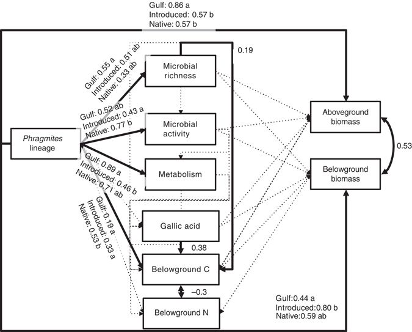
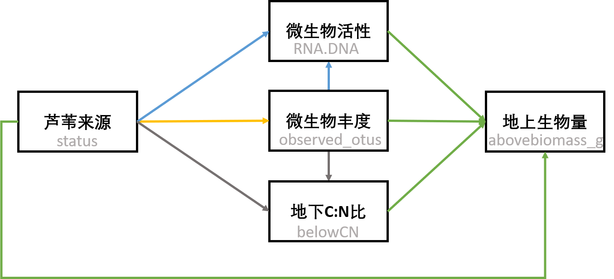

### 学习记录
>使用Bowen et al. (2017)的数据拟合他们完整路径图的简化版本，只关注地上生物量。从而达到学习结构方程模型的拟合和结果解读的目的。

文章中的采用距离标准化系数拟合结构方程模型：


现在学习阶段拟合以下简化结构方程模型：


按照文章提供的代码尝试进行了简化SEM的拟合如下：
```{r}
bowen <- read.csv("../Data/bowen.csv")
bowen <- na.omit(bowen)
library(piecewiseSEM)
library(nlme)
bowen_sem <- psem(
  lme(observed_otus ~ status, random = ~1|Genotype, data = bowen, method = "ML"),
  lme(RNA.DNA ~ status + observed_otus, random = ~1|Genotype, data = bowen, method = "ML"), 
  lme(belowCN ~ observed_otus + status, random = ~1|Genotype, data = bowen, method = "ML"), 
  lme(abovebiomass_g ~ RNA.DNA + observed_otus + belowCN + status, random = ~1|Genotype, data = bowen, method = "ML"),
  data = bowen
)

#get SEM fit information
summary(bowen_sem, .progressBar = F)
```

会出现报错：
```txt
Calling var(x) on a factor x is deprecated and will become an error.
  Use something like 'all(duplicated(x)[-1L])' to test for a constant vector.Calling var(x) on a factor x is deprecated and will become an error.
  Use something like 'all(duplicated(x)[-1L])' to test for a constant vector.longer object length is not a multiple of shorter object lengthCalling var(x) on a factor x is deprecated and will become an error.
  Use something like 'all(duplicated(x)[-1L])' to test for a constant vector.longer object length is not a multiple of shorter object lengthCalling var(x) on a factor x is deprecated and will become an error.
  Use something like 'all(duplicated(x)[-1L])' to test for a constant vector.longer object length is not a multiple of shorter object length
```

并且无法进行标准化：
```{r}
ctab <- coefs(bowen_sem, standardize = "none", intercepts = TRUE)
# std_ctab <- coefs(bowen_sem, standardize = "range", intercepts = TRUE)
```

### 存在的问题
- 先不管存在的报错，假设模型构建正确，如何解读结果，即在简化的SME模型上添加相应的数值。

- 报错是否是因为模型构建错误？为什么不能进行`range`标准化？

- 关于SEM的中文资料比较少，老师是否有其他的数据教程可供学习？


### 参考文献
Bowen, J. L., Kearns, P. J., Byrnes, J. E. K., Wigginton, S., Allen, W. J., Greenwood, M., et al. (2017). Lineage overwhelms environmental conditions in determining rhizosphere bacterial community structure in a cosmopolitan invasive plant. Nat Commun 8, 1–8. doi:10.1038/s41467-017-00626-0.


